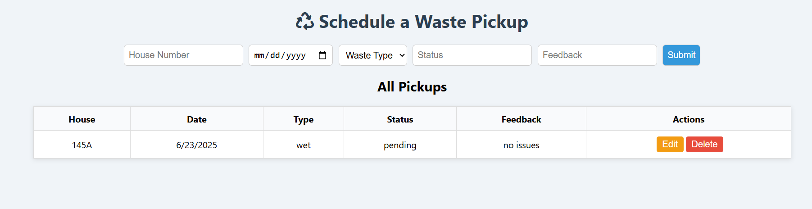

# 🗑️ Smart Waste Pickup Tracker

A simple full-stack application to help communities manage and track household waste pickups.

---

## 📌 About

This project allows users to:
- Schedule waste pickups by providing house details, type of waste, and date.
- View all scheduled pickups.
- Update the status or feedback of a pickup.
- Delete a pickup if needed.

---

## 🔧 Technologies Used

- **Backend**: Node.js + Express
- **Database**: MongoDB (via Mongoose)
- **Frontend**: HTML, CSS, and JavaScript
- **API Testing**: curl 

---

## API Endpoints & Functionality

| Method | Endpoint             | Functionality                        |
|--------|----------------------|--------------------------------------|
| POST   | `/api/pickups`       | Add a new pickup                     |
| GET    | `/api/pickups`       | Retrieve all pickups                 |
| GET    | `/api/pickups/:id`   | Retrieve a pickup by its ID          |
| PUT    | `/api/pickups/:id`   | Update pickup status or feedback     |
| DELETE | `/api/pickups/:id`   | Delete a pickup                      |

### 🧾 Example JSON Body for POST/PUT
```json
{
  "houseNumber": "123A",
  "date": "2025-06-20",
  "wasteType": "wet",
  "status": "pending",
  "feedback": "No issues"
}
```

---

## 🛢️ Database Integration

MongoDB is used as the database.

Connected via **Mongoose**.

The connection string is stored in a `.env` file:

---
## 🚀 How to Run the Server

1. Open terminal and go to the `backend` folder:
   ```bash
   cd backend
   ```
2. Install required packages:
```
   npm install
```
3. Create a .env file with:  
```
MONGO_URI=mongodb://127.0.0.1:27017/smartwaste
PORT=5000
```
4. Start the server:
```
node index.js
```
## 🔍 How to Use the API

### ➕ Create a Pickup
Send a POST request to:

POST /api/pickups
**Sample JSON Body**:
```json
{
  "houseNumber": "123A",
  "date": "2025-06-20",
  "wasteType": "wet",
  "status": "pending",
  "feedback": "No issues"
}
```
 Get All Pickups

Send a GET request to:
```
GET /api/pickups
```
Update a Pickup

Send a PUT request to:
```
PUT /api/pickups/:id
```
 
Delete a Pickup

Send a DELETE request to:
```
DELETE /api/pickups/:id
```
 Note: Replace :id with the actual pickup _id from MongoDB database.

## 🖼️ Preview

Here is a preview of the Smart Waste Pickup Tracker frontend:




